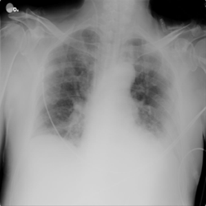
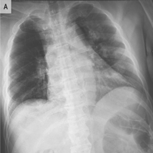
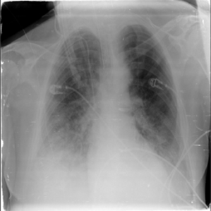
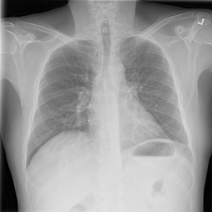
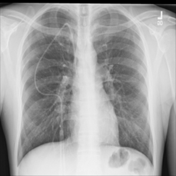
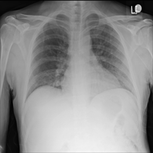

# Machine Learning API on Cloud Compute Engine
### 1. Write the Flask server app using Python

- Save the model in `'.h5'` format in the same directory as `main.py`
- Load the model and write Flask code in `main.py` 
- Test the Flask server locally by running `main.py`, copy the local URL set to postman for image test
- Choose **POST** for HTTP Request, click form-data in Body and then field the key and choose image file

### 2. Setup Google Cloud
- Create VM in Google Compute Engine
- Choose Boost Disk `debian-10-tf-2-4-1-v20210412`
- Create firewall with network tag same with compute engine

### 3. Cloud Engine Run Server for Model]
- Run SSH on already created VM
- Clone git repository `https://github.com/haidarfahmii/predict-covid-model.git`
- Go to the predict-covid-model directory : `cd predict-covid-model`
- Install Flask in VM : `pip install flask`
- Run `main.py` with command : `python3 main.py` or `nohup python3 main.py`

### 4. Test
- You can test image using this image `Test/img`:
- **COVID Image** :

    

- **Pneumonia Image** :

  

- **Normal Image** :

  
